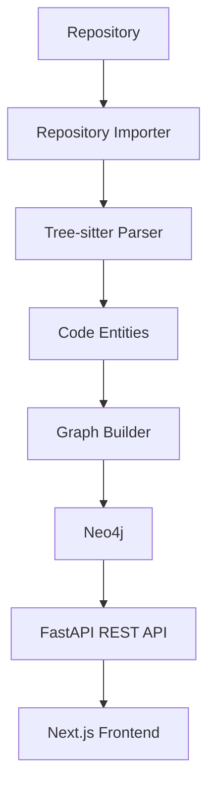
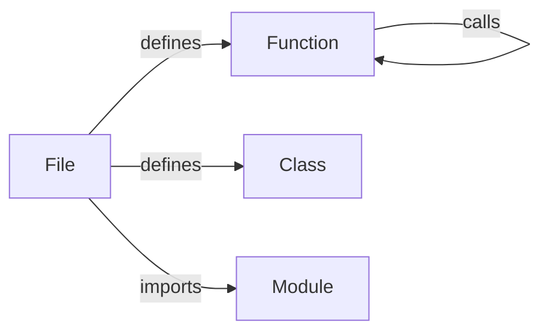

# TENVOR

> Understand every layer of your codebase.

TENVOR is a codebase intelligence platform that transforms a software repository into an explorable graph of files, functions, classes, imports, and call relationships. It helps developers understand unfamiliar codebases, navigate dependencies, trace function calls, and reason about the impact of changes.

---

## Overview

When a codebase grows past a certain size, intuition breaks down. Developers spend time grepping for answers that should be queryable, making changes without knowing what will break, and navigating unfamiliar code structures without a map.

TENVOR addresses this by treating source code as a property graph. Every file, function, class, and import becomes a node. Every call relationship, definition, and dependency becomes an edge. The result is a structured, queryable, and visually explorable representation of the entire codebase.

---

## Why TENVOR?

- **Find what you're looking for.** Search across all indexed functions, classes, and files by name or file path.
- **Understand call relationships.** See exactly what calls a function and what that function calls.
- **Reason about change impact.** Before modifying a function, understand what depends on it.
- **Navigate architecture.** Visualize the connections between files, modules, and functions.
- **Onboard faster.** Give developers a map of an unfamiliar codebase from day one.

---

## Features

### Implemented

- Repository import from any Git URL
- Repository file scanning and language detection
- Python source parsing using Tree-sitter
- Function, class, and import extraction
- Function call relationship detection
- In-memory code graph construction
- Neo4j graph persistence
- Graph node queries (all nodes, filtered by type)
- Graph relationship queries
- Codebase statistics (node count, edge count)
- Function caller lookup
- Function callee lookup
- Function impact analysis
- Full-text codebase search
- FastAPI REST API
- Next.js frontend with interactive graph, search, file explorer, and impact analysis views
- Light and dark UI themes

### Not yet implemented (roadmap)

See [Roadmap](#roadmap).

---

## Architecture

```
Repository
    │
    ▼
Repository Importer        (git clone, file scan, language detection)
    │
    ▼
Tree-sitter Parser          (Python — functions, classes, imports, calls)
    │
    ▼
Graph Builder               (nodes + edges in memory)
    │
    ▼
Neo4j                       (persistent property graph)
    │
    ▼
FastAPI                     (REST API, graph queries, search)
    │
    ▼
Next.js Frontend            (graph visualization, search, impact analysis)
```



### Graph data model

Every parsed entity becomes a `CodeNode` with properties: `id`, `node_type`, `name`, `file_path`, `line`.

Relationships are stored as `RELATES` edges with a `type` property.



Node types:

| Type | Description |
|------|-------------|
| `file` | A source file |
| `function` | A function definition |
| `class` | A class definition |
| `import` | An import statement |

Relationship types:

| Type | Description |
|------|-------------|
| `defined_in` | Entity is defined in a file |
| `imports` | File imports a module |
| `calls` | Function calls another function |

---

## Tech Stack

| Layer | Technology |
|-------|-----------|
| Frontend | Next.js, TypeScript, Tailwind CSS |
| Backend | FastAPI, Python |
| Parsing | Tree-sitter (`tree-sitter-python`) |
| Graph database | Neo4j |
| Package management | pip, npm |

---

## Project Structure

```
tenvor/
├── backend/
│   ├── app/
│   │   ├── api/
│   │   │   ├── graph.py          # Graph endpoints
│   │   │   └── repositories.py   # Repository import endpoint
│   │   ├── core/
│   │   ├── models/
│   │   └── services/
│   │       ├── github/
│   │       ├── graph/
│   │       │   ├── builder.py    # Graph construction
│   │       │   ├── database.py   # Neo4j operations
│   │       │   └── models.py     # Graph data models
│   │       ├── indexer/
│   │       │   └── service.py    # Orchestrates parse → build → persist
│   │       ├── parser/
│   │       │   ├── models.py     # ParseResult, CodeEntity, CodeCall
│   │       │   ├── repository.py # Walks a repository and parses .py files
│   │       │   └── service.py    # Tree-sitter Python parser
│   │       └── repository/
│   │           └── service.py    # Git clone and file scan
│   └── tests/
│
├── frontend/
│   └── src/
│       ├── app/
│       │   ├── (app)/            # Application pages (with sidebar layout)
│       │   │   ├── overview/
│       │   │   ├── repositories/
│       │   │   ├── files/
│       │   │   ├── graph/
│       │   │   ├── search/
│       │   │   ├── impact/
│       │   │   ├── docs/
│       │   │   ├── blog/
│       │   │   ├── settings/
│       │   │   └── api-docs/
│       │   └── page.tsx          # Landing page
│       ├── components/
│       │   ├── layout/           # AppShell, Sidebar, TopBar
│       │   └── ui/               # StatCard, Badge, States
│       └── lib/
│           ├── api/              # Typed client, hooks, types
│           └── blog/             # Blog post content
│
├── infrastructure/
│   └── docker/
│
├── docs/
├── data/
│   └── repositories/             # Cloned repositories
├── README.md
├── CONTRIBUTING.md
├── SECURITY.md
├── CODE_OF_CONDUCT.md
├── LICENSE
├── .env.example
└── docker-compose.yml
```

---

## Getting Started

### Requirements

- Python 3.9 or later
- Node.js 18 or later
- npm
- Docker (for Neo4j)

### 1. Clone the repository

```bash
git clone https://github.com/your-org/tenvor.git
cd tenvor
```

### 2. Start Neo4j

```bash
docker run -d \
  --name tenvor-neo4j \
  -p 7474:7474 \
  -p 7687:7687 \
  -e NEO4J_AUTH=neo4j/tenvor123 \
  neo4j:5
```

Neo4j Browser is available at `http://localhost:7474` once the container is running.

> **Note:** The default credentials above are for local development only. Use secure credentials and environment variables for any other deployment.

### 3. Set up the backend

```bash
cd backend
python3 -m venv .venv
source .venv/bin/activate
pip install -r requirements.txt
```

### 4. Set up the frontend

```bash
cd frontend
npm install
```

---

## Running Locally

### Start the backend

```bash
cd backend
source .venv/bin/activate
uvicorn app.main:app --reload --port 8001
```

Backend runs at `http://127.0.0.1:8001`.  
Interactive API documentation: `http://127.0.0.1:8001/docs`.

### Start the frontend

```bash
cd frontend
npm run dev
```

Frontend runs at `http://localhost:3000`.

---

## Neo4j Setup

TENVOR uses Neo4j as its graph database. The connection is configured through environment variables.

For local development, the simplest setup is the official Docker image:

```bash
docker run -d \
  --name tenvor-neo4j \
  -p 7474:7474 \
  -p 7687:7687 \
  -e NEO4J_AUTH=neo4j/tenvor123 \
  neo4j:5
```

| Port | Service |
|------|---------|
| `7474` | Neo4j Browser (HTTP) |
| `7687` | Bolt protocol (application connection) |

The default development credentials (`neo4j` / `tenvor123`) match the defaults configured in the backend. To use different credentials, set the environment variables described below.

---

## Environment Variables

### Backend

| Variable | Default | Description |
|----------|---------|-------------|
| `NEO4J_URI` | `bolt://localhost:7687` | Neo4j connection URI |
| `NEO4J_USERNAME` | `neo4j` | Neo4j username |
| `NEO4J_PASSWORD` | `tenvor123` | Neo4j password |

### Frontend

| Variable | Default | Description |
|----------|---------|-------------|
| `NEXT_PUBLIC_API_URL` | `http://127.0.0.1:8001` | Base URL for the TENVOR API |

Copy `.env.example` to `.env` in the relevant directory and update values as needed.

---

## API

The TENVOR backend exposes a REST API built with FastAPI. Full interactive documentation is available at `/docs` when running locally.

### Health

#### `GET /health`

Returns the API status and version.

```bash
curl http://127.0.0.1:8001/health
```

```json
{
  "status": "ok",
  "service": "tenvor-api",
  "version": "0.1.0"
}
```

---

### Repositories

#### `POST /repositories/import`

Clone a Git repository and scan it for files and language statistics. Returns repository metadata including file count and language distribution.

```bash
curl -X POST http://127.0.0.1:8001/repositories/import \
  -H "Content-Type: application/json" \
  -d '{"url": "https://github.com/example/project.git"}'
```

```json
{
  "repository_id": "3f2a1b4c-...",
  "path": "data/repositories/3f2a1b4c-...",
  "file_count": 47,
  "languages": {
    "Python": 32,
    "TypeScript": 9,
    "JavaScript": 6
  },
  "files": ["src/main.py", "src/parser.py", "..."]
}
```

> **Note:** This endpoint clones and scans the repository. Parsing and graph indexing are handled by the `RepositoryIndexer` service and are not yet wired to this HTTP endpoint in the current version. Files are cloned to `data/repositories/`.

---

### Graph

#### `GET /graph/nodes`

Returns all indexed nodes. Optionally filter by type.

```
GET /graph/nodes
GET /graph/nodes?node_type=function
GET /graph/nodes?node_type=class
GET /graph/nodes?node_type=file
GET /graph/nodes?node_type=import
```

```json
{
  "nodes": [
    {
      "id": "function:app/parser.py:parse_file",
      "node_type": "function",
      "name": "parse_file",
      "file_path": "app/parser.py",
      "line": 14
    }
  ]
}
```

#### `GET /graph/relationships`

Returns all relationships between nodes.

```json
{
  "relationships": [
    {
      "source": "parse_file",
      "source_type": "function",
      "relation": "calls",
      "target": "build_graph",
      "target_type": "function"
    }
  ]
}
```

#### `GET /graph/stats`

Returns aggregate counts for the graph.

```json
{
  "nodes": 142,
  "edges": 89
}
```

#### `GET /graph/search?q=`

Search all indexed nodes by name or file path. Case-insensitive substring match. Returns up to 50 results.

```
GET /graph/search?q=parse_file
```

```json
{
  "query": "parse_file",
  "results": [
    {
      "id": "function:app/parser.py:parse_file",
      "name": "parse_file",
      "node_type": "function",
      "file_path": "app/parser.py",
      "line": 14
    }
  ]
}
```

---

### Functions

#### `GET /graph/functions/{function_name}/callers`

Returns all functions in the graph that call the specified function.

```
GET /graph/functions/parse_file/callers
```

```json
{
  "function": "parse_file",
  "callers": [
    {
      "caller": "index_repository",
      "caller_file": "app/services/indexer/service.py",
      "target": "parse_file",
      "target_file": "app/services/parser/service.py"
    }
  ]
}
```

#### `GET /graph/functions/{function_name}/callees`

Returns all functions that the specified function calls.

```
GET /graph/functions/parse_file/callees
```

```json
{
  "function": "parse_file",
  "callees": [
    {
      "source": "parse_file",
      "source_file": "app/services/parser/service.py",
      "callee": "_walk",
      "callee_file": "app/services/parser/service.py"
    }
  ]
}
```

#### `GET /graph/functions/{function_name}/impact`

Returns all call relationships that involve the specified function as either source or target. Use this to understand the full connectivity of a function in the graph.

```
GET /graph/functions/parse_file/impact
```

```json
{
  "function": "parse_file",
  "impact": [
    {
      "source": "index_repository",
      "source_file": "app/services/indexer/service.py",
      "target": "parse_file",
      "target_file": "app/services/parser/service.py"
    }
  ]
}
```

---

## How to Use TENVOR

1. **Start Neo4j.** Run the Docker command above or connect to an existing Neo4j instance.

2. **Start the backend.** Run `uvicorn app.main:app --reload --port 8001` from the `backend` directory.

3. **Start the frontend.** Run `npm run dev` from the `frontend` directory.

4. **Open the frontend.** Navigate to `http://localhost:3000`.

5. **Import a repository.** Go to the Repositories page and enter a GitHub repository URL. TENVOR will clone the repository and scan its files.

6. **Explore the codebase graph.** Navigate to the Graph page to see an interactive visualization of indexed nodes and relationships. Filter by node type, zoom, pan, and click nodes to inspect them.

7. **Search the codebase.** Use the Search page or the global search bar to find functions, classes, and files by name or path.

8. **Inspect callers and callees.** Click any function node in the graph to see what calls it and what it calls. Or navigate directly to Impact Analysis from any search result.

9. **Analyze change impact.** Use the Impact Analysis page to understand the full set of relationships involving a function before making changes.

10. **Browse files.** Navigate to the Files page to browse indexed source files and the entities defined within them.

---

## Codebase Intelligence

### How it works

#### 1. Repository ingestion

TENVOR accepts a Git URL. It performs a shallow clone (`--depth 1`) for speed, then scans all files in the repository, filtering out known non-source directories (`.git`, `.venv`, `node_modules`, `__pycache__`).

#### 2. Parsing

The repository parser walks the cloned directory and processes each source file. Currently, `.py` files are parsed using the `PythonParser`, which uses Tree-sitter with the `tree-sitter-python` grammar.

#### 3. Entity extraction

Tree-sitter produces a concrete syntax tree for each file. The parser walks the tree and extracts:

- **Functions** — `function_definition` nodes, capturing name and line number
- **Classes** — `class_definition` nodes, capturing name and line number
- **Imports** — `import_statement` and `import_from_statement` nodes, capturing the full import text

#### 4. Relationship extraction

While walking the syntax tree, the parser tracks the current enclosing function and identifies `call` nodes. For each call, it records the caller function name and callee expression.

#### 5. Graph construction

The `GraphBuilder` converts parsed results into a `CodeGraph`:

- Each file becomes a `file` node
- Each entity (function, class, import) becomes a typed node
- Each entity gets a `defined_in` edge to its file
- Each import gets an `imports` edge from its file
- Each resolved call gets a `calls` edge between function nodes

Call resolution is name-based: if the callee expression matches a known function name, an edge is created. Cross-file resolution uses file path matching.

#### 6. Neo4j persistence

The graph is saved to Neo4j using `MERGE` operations to avoid duplicates. Nodes use a composite ID: `{type}:{file_path}:{name}`.

#### 7. Search

The search endpoint queries Neo4j with a `CONTAINS` match on node name and file path, returning up to 50 results ordered by name.

#### 8. Call graph analysis

Caller and callee queries use Cypher traversals on the `RELATES {type: "calls"}` edges. The queries are scoped to direct relationships (one hop).

#### 9. Impact analysis

The impact endpoint returns all `calls` relationships where the specified function appears as either source or target. This gives a combined view of inbound and outbound call connections.

#### 10. Frontend visualization

The Next.js frontend uses `@xyflow/react` (React Flow) to render the code graph as an interactive canvas. Nodes are color-coded by type. Selecting a node opens an inspector panel showing its properties, callers, and callees.

---

## Screenshots

Screenshots will be added as the project matures. Contributions of screenshots are welcome.

Planned screenshot locations:

```
docs/screenshots/dashboard.png
docs/screenshots/graph.png
docs/screenshots/search.png
docs/screenshots/impact-analysis.png
docs/screenshots/repository-import.png
docs/screenshots/file-explorer.png
docs/screenshots/documentation.png
docs/screenshots/blog.png
```

---

## Design Philosophy

TENVOR is built on a few core convictions:

**Code is a graph, not a file tree.** The relationships between functions, modules, and files are the most important structural information in a codebase. A flat file tree hides this structure. A graph makes it explicit.

**Intelligence should be earned, not invented.** TENVOR derives structure from actual source code using a real parser. It does not rely on heuristics, fake data, or LLM hallucination to describe your codebase.

**Developer tools should be fast and usable.** The graph should load quickly, search results should appear immediately, and navigation should feel natural.

**The graph is a foundation.** Codebase search, call analysis, and impact detection are the first layer. The graph enables deeper capabilities over time.

---

## Roadmap

The following features are planned and not yet implemented:

- **Additional language support** — JavaScript, TypeScript, Go, Java, and others via Tree-sitter grammars
- **Cross-file symbol resolution** — improved call resolution using import analysis
- **Advanced dependency graphs** — module-level and package-level dependency views
- **Architecture maps** — automatically generated high-level views of system structure
- **GitHub integration** — connect repositories via the GitHub API, sync on push
- **Pull request intelligence** — analyze the impact of changes in a pull request before merge
- **Change impact prediction** — trace the propagation of a change through the call graph
- **AI codebase agent** — answer questions about a codebase in natural language
- **Natural-language queries** — ask questions like "where is authentication handled?"
- **MCP integration** — expose graph intelligence as a Model Context Protocol server
- **Multi-repository graphs** — connect and cross-reference multiple codebases
- **Enterprise authentication** — SSO, RBAC, and team-based access control
- **Team workspaces** — shared graph views, annotations, and bookmarks
- **Production-scale indexing** — incremental updates, background indexing pipelines

---

## AI Direction

TENVOR's long-term direction includes an AI layer that can reason about the codebase graph. The graph provides the structured context that language models often lack when answering questions about specific codebases.

Planned capabilities include:

- Explain what a function does based on its call context
- Describe the architecture of a module or service
- Answer questions like "what handles authentication?" or "where does this data flow?"
- Find relevant code given a natural-language description of behavior
- Trace execution paths through the call graph
- Predict which functions are affected by a proposed change

This layer is in early design. The current system provides the graph foundation it requires.

---

## Contributing

Contributions are welcome. See [CONTRIBUTING.md](CONTRIBUTING.md) for full guidance.

The general workflow:

1. Fork the repository.
2. Create a branch from `main`: `git checkout -b feature/your-feature`.
3. Make your changes.
4. Run any existing tests: `cd backend && python -m pytest`.
5. Ensure the frontend builds without errors: `cd frontend && npm run build`.
6. Open a pull request with a clear description of the change and why it is needed.

Please follow existing code style conventions. Backend code uses Python type hints throughout. Frontend code uses strict TypeScript.

---

## Security

For security vulnerabilities, see [SECURITY.md](SECURITY.md).

Do not open public GitHub issues for security-sensitive reports. Follow the process described in SECURITY.md.

---

## License

This project is licensed under the MIT License. See [LICENSE](LICENSE) for details.

---

## Project Status

TENVOR is under active development.

The current system includes a working backend intelligence MVP (repository import, Tree-sitter parsing, Neo4j graph persistence, REST API) and an actively developed Next.js frontend with interactive graph visualization, search, impact analysis, and documentation.

The platform is not yet production-ready. APIs may change. Features are being added. Feedback and contributions are welcome.
