# TENVOR

> Understand every layer of your codebase.

TENVOR is a codebase intelligence platform that transforms a software repository into an explorable graph of files, functions, classes, imports, and call relationships. It helps developers understand unfamiliar codebases, navigate dependencies, search code relationships, inspect call paths, and analyze potential impact before making changes.

![TENVOR Landing Page] 


---

## Overview

When a codebase grows past a certain size, intuition breaks down. Developers spend time grepping for answers that should be queryable, making changes without knowing what will break, and navigating unfamiliar code structures without a map.

TENVOR addresses this by treating source code as a property graph. Every file, function, class, and import becomes a node. Every call relationship, definition, and dependency becomes an edge. The result is a structured, queryable, and visually explorable representation of the entire codebase.

---

## Why TENVOR?

- **Find what you're looking for.** Search across all indexed functions, classes, and files by name or file path.
- **Understand call relationships.** See exactly what calls a function and what that function calls.
- **Reason about change impact.** Before modifying a function, understand what depends on it.
- **Navigate architecture.** Visualize the connections between files, modules, and functions.
- **Onboard faster.** Give developers a map of an unfamiliar codebase from day one.

---

## Features

### Implemented

- Repository import from any Git URL
- Repository file scanning and language detection
- Python source parsing using Tree-sitter
- Function, class, and import extraction
- Function call relationship detection
- In-memory code graph construction
- Neo4j graph persistence
- Graph node queries (all nodes, filtered by type)
- Graph relationship queries
- Codebase statistics (node count, edge count)
- Function caller lookup
- Function callee lookup
- Function impact analysis
- Full-text codebase search
- FastAPI REST API
- Next.js frontend with interactive graph, search, file explorer, and impact analysis views
- Light and dark UI themes

### Not yet implemented (roadmap)

See [Roadmap](#roadmap).

---

## How TENVOR Works

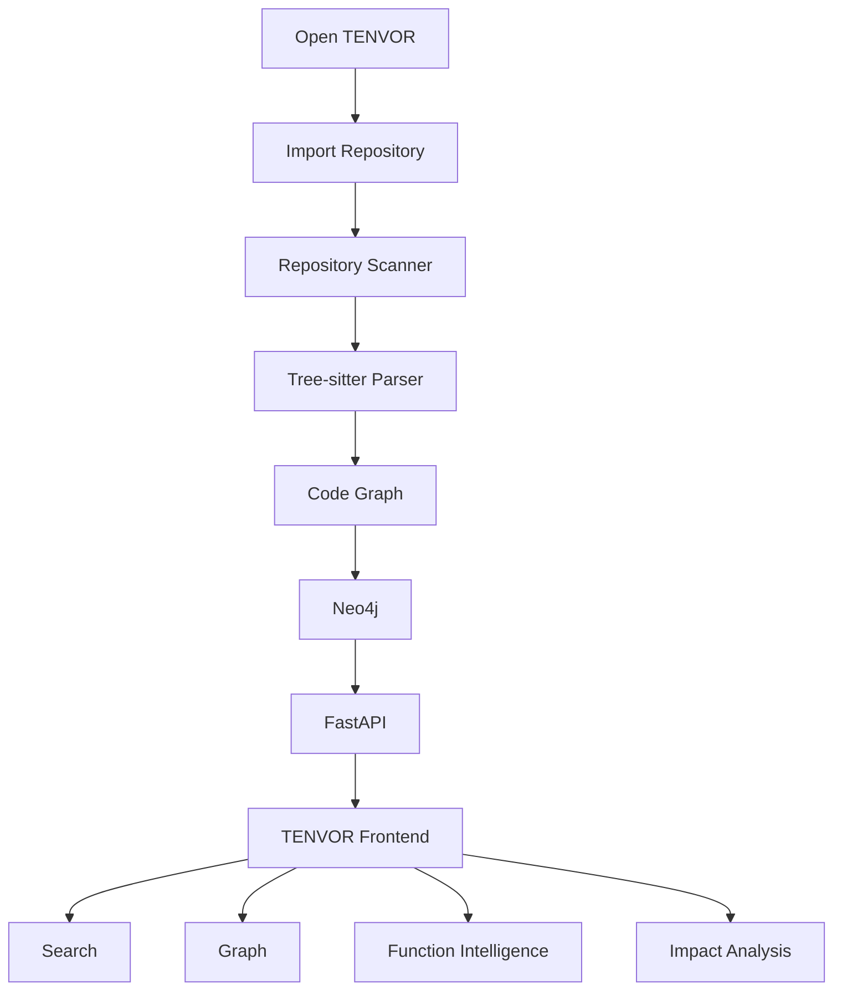

### Step 1 — Open TENVOR

Navigate to `http://localhost:3000`. The TENVOR frontend presents the Overview dashboard if a codebase has been indexed, or guides you to import a repository first.

### Step 2 — Import a repository

Go to the **Repositories** page and enter a public GitHub repository URL. The frontend sends the request to the backend:

```
POST /repositories/import
{ "url": "https://github.com/owner/repository" }
```

TENVOR performs a shallow clone (`--depth 1`) for speed, then scans all files for language statistics.

### Step 3 — Repository processing

After the clone completes, the backend pipeline runs:

```
Repository URL
  → Git clone (shallow, --depth 1)
  → File scan (all files, language detection)
  → Tree-sitter parser (per .py file)
  → Entity extraction (functions, classes, imports)
  → Call relationship extraction (caller → callee)
  → Graph builder (nodes + edges in memory)
  → Neo4j persistence (MERGE operations)
```

### Step 4 — The code graph

TENVOR represents your codebase as a property graph. Entities become nodes; relationships become edges:

```
File
  ↓ defines
Function
  ↓ calls
Function

File
  ↓ imports
Module
```

Every node carries an `id`, `node_type`, `name`, `file_path`, and `line`. Edges carry a `type`: `defined_in`, `calls`, or `imports`.

### Step 5 — Explore

The Overview dashboard shows live statistics pulled from Neo4j: total nodes, relationships, functions, classes, files, and imports. A functions table lists all indexed functions with their file paths and line numbers, each linking directly to Impact Analysis.

### Step 6 — Search

Use the **Search** page or the global search bar in the top bar to find anything across the indexed codebase. The frontend queries:

```
GET /graph/search?q=your_query
```

Results are grouped by type (functions, classes, files, imports) and include file paths and line numbers. Clicking a function result navigates to its Impact Analysis.

### Step 7 — Function intelligence

Select any function to inspect its full call context. The frontend calls three endpoints:

```
GET /graph/functions/{function_name}/callers
GET /graph/functions/{function_name}/callees
GET /graph/functions/{function_name}/impact
```

**Callers** — functions that call this function.  
**Callees** — functions this function calls.  
**Impact** — all call relationships involving this function as either source or target.

### Step 8 — Understand impact

Before modifying a function, open Impact Analysis to see:

- How many functions call it directly
- What other functions it depends on
- The full set of call relationships it participates in

This gives you a structural picture of the blast radius of any proposed change.

---

## Frontend

The TENVOR frontend is a Next.js application running at `http://localhost:3000`. It includes a collapsible sidebar, global search bar, and theme switcher. All pages connect to the live backend API.

### Overview

The dashboard shows the current state of the indexed codebase. Live statistics are fetched from the backend at page load.

- Total node count
- Relationship count
- Function count
- Class count
- File count
- Import count
- Quick action cards (Import, Browse, Graph, Search)
- Functions table with file paths, line numbers, and direct links to Impact Analysis


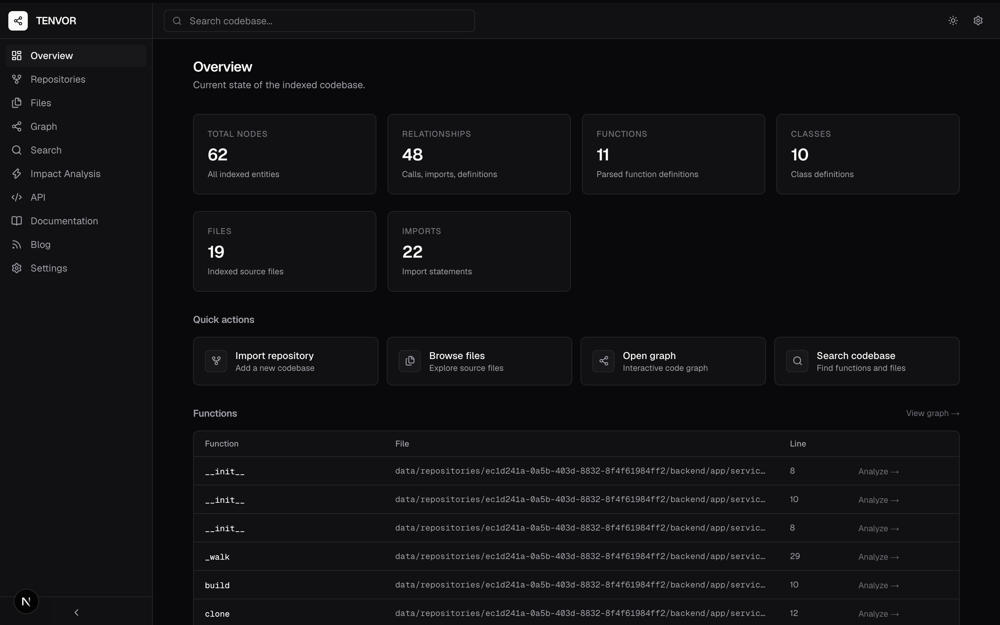

---

### Repositories

The Repositories page handles repository import. Enter a GitHub URL and click **Import repository**. The frontend calls `POST /repositories/import` and displays the result: repository ID, file count, language distribution, and local clone path.

If the import fails, a detailed error message is shown. No fake success states.

![Repository Import]. 


---

### Files

The Files page shows a filterable list of all indexed source files. Clicking a file opens a detail panel on the right showing:

- Full file path
- Node ID
- All functions and classes defined in the file (with line numbers)
- Direct links to Impact Analysis for each function

![File Explorer]. 


---

### Graph

The Graph page renders all indexed nodes and relationships as an interactive canvas using React Flow. Node types are color-coded: files in blue, functions in green, classes in amber, imports in purple.

Controls:

- **Zoom and pan** — scroll to zoom, click-drag to pan
- **Node filter** — filter by File, Function, Class, or Import
- **Node search** — filter visible nodes by name
- **Node inspector** — click any node to open a side panel showing its type, file path, line number, callers, and callees
- **Full impact link** — from the inspector, navigate directly to Impact Analysis

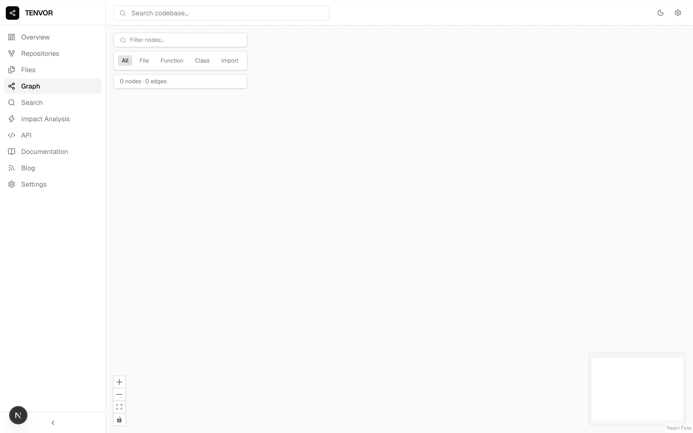

---

### Search

The Search page provides real-time codebase search. Results appear as you type (300ms debounce) and are grouped by node type. Each result shows the node name, type badge, file path, and line number. Function results include a direct link to Impact Analysis.

The backend endpoint: `GET /graph/search?q=`

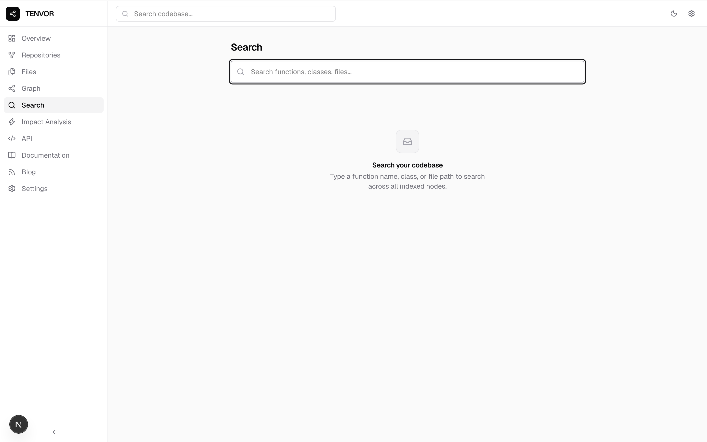

---

### Impact Analysis

The Impact Analysis page provides a complete view of a function's connectivity in the code graph. Navigate here from any function in the Overview table, Search results, or Graph inspector.

Shows:

- **Direct callers count** — how many functions call this one
- **Direct callees count** — how many functions this one calls
- **Total impact relationships** — full count of call edges involving this function
- **Callers list** — function name and source file for each caller
- **Callees list** — function name and source file for each callee
- **Full impact chain** — all call relationships shown as `source → target` pairs

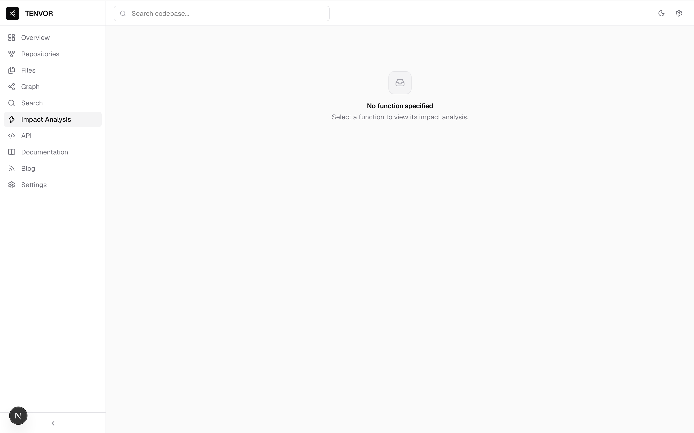

---

### Documentation

The built-in Documentation page is a complete technical reference for TENVOR. It covers repository ingestion, Tree-sitter parsing, the code graph model, Neo4j setup, search, call graph analysis, impact analysis, and the full API.

Available at `/docs` inside the app.

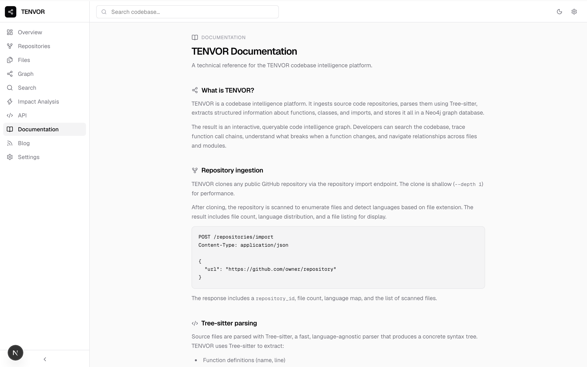

---

### Blog

The Blog section contains technical articles on codebase intelligence, graph databases, and developer tooling. Articles open on individual pages at `/blog/[slug]`.

Published articles:

- Understanding Codebases as Graphs
- Why Codebase Intelligence Matters
- Tree-sitter and Source Code Parsing
- Call Graphs and Impact Analysis
- Neo4j for Developer Tooling

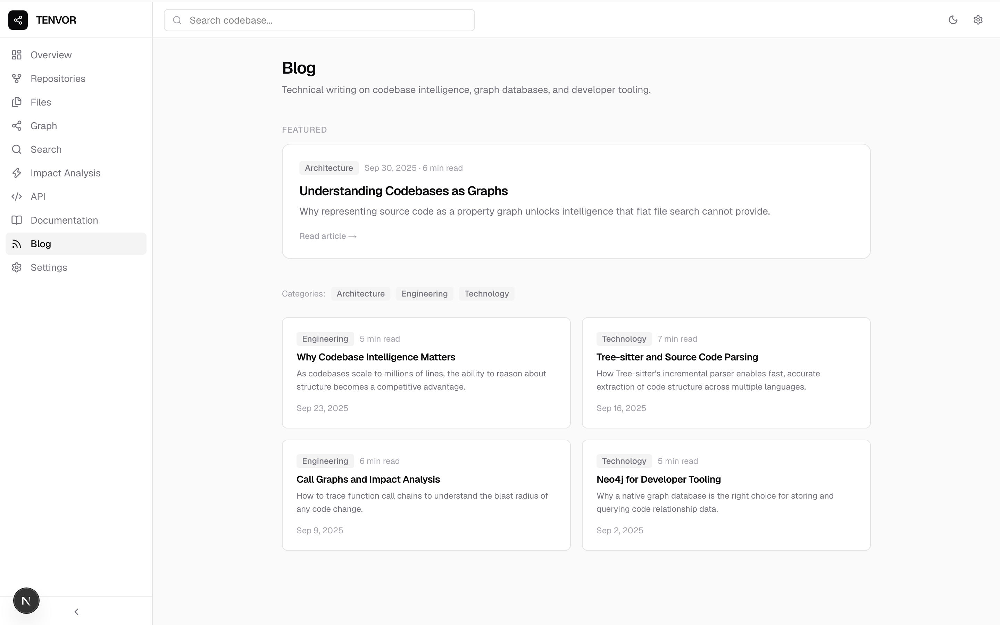

---

### Settings

The Settings page controls application appearance and shows the current backend connection status. Theme can be set to System, Light, or Dark. The API URL and backend version are displayed, with a live connection indicator.

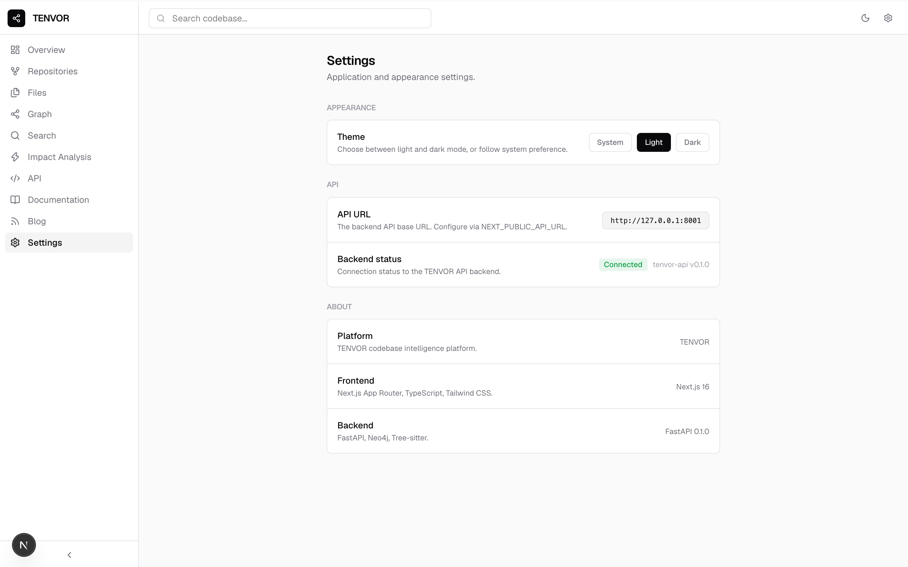

---

### Light and dark themes

TENVOR supports both light and dark themes, switchable via the top bar or the Settings page. Theme preference is persisted in the browser.

| Light | Dark |
|-------|------|
| 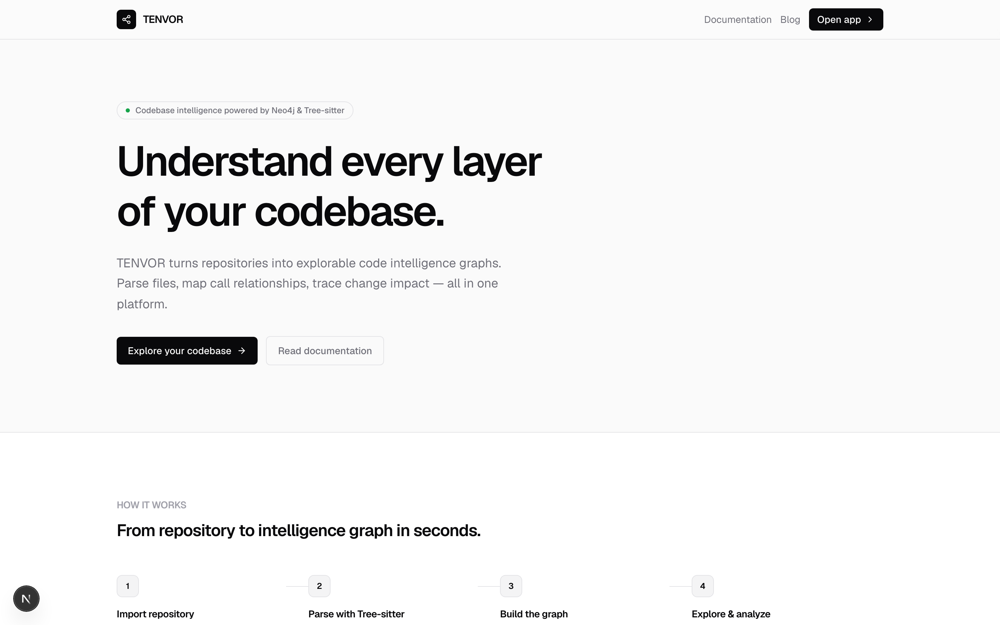 | 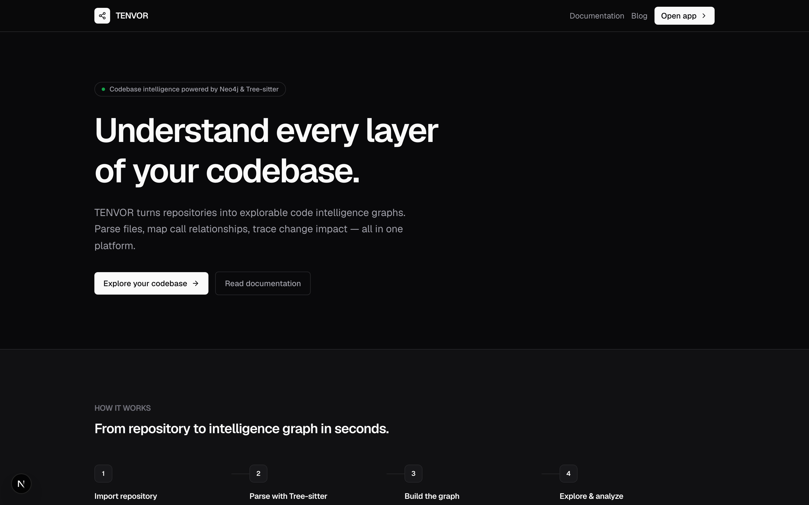 |

---

## Architecture

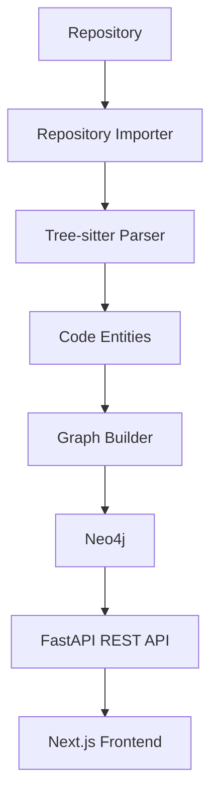

### Graph data model

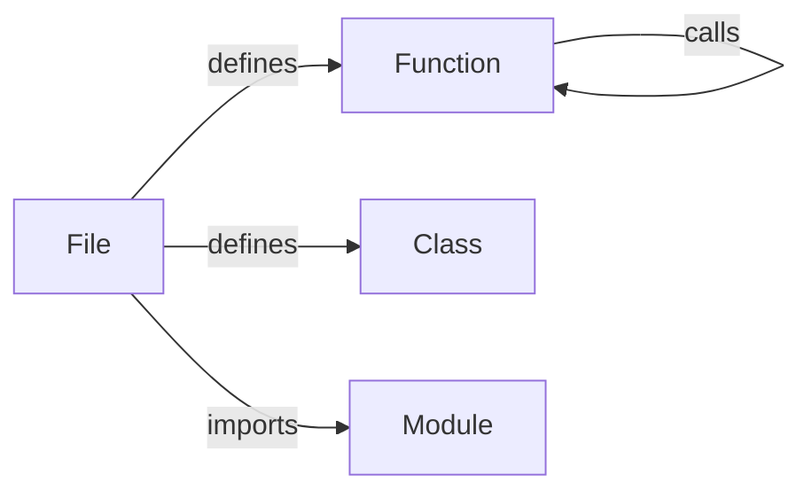

Node types:

| Type | Description |
|------|-------------|
| `file` | A source file |
| `function` | A function definition |
| `class` | A class definition |
| `import` | An import statement |

Relationship types:

| Type | Description |
|------|-------------|
| `defined_in` | Entity is defined in a file |
| `imports` | File imports a module |
| `calls` | Function calls another function |

---

## Tech Stack

| Layer | Technology |
|-------|-----------|
| Frontend | Next.js, TypeScript, Tailwind CSS |
| Backend | FastAPI, Python |
| Parsing | Tree-sitter (`tree-sitter-python`) |
| Graph database | Neo4j |
| Package management | pip, npm |

---

## Project Structure

```
tenvor/
├── backend/
│   ├── app/
│   │   ├── api/
│   │   │   ├── graph.py          # Graph endpoints
│   │   │   └── repositories.py   # Repository import endpoint
│   │   ├── core/
│   │   ├── models/
│   │   └── services/
│   │       ├── graph/
│   │       │   ├── builder.py    # Graph construction
│   │       │   ├── database.py   # Neo4j operations
│   │       │   └── models.py     # Graph data models
│   │       ├── indexer/
│   │       │   └── service.py    # Orchestrates parse → build → persist
│   │       ├── parser/
│   │       │   ├── models.py     # ParseResult, CodeEntity, CodeCall
│   │       │   ├── repository.py # Walks a repository and parses .py files
│   │       │   └── service.py    # Tree-sitter Python parser
│   │       └── repository/
│   │           └── service.py    # Git clone and file scan
│   └── tests/
│
├── frontend/
│   └── src/
│       ├── app/
│       │   ├── (app)/            # Application pages (with sidebar layout)
│       │   │   ├── overview/
│       │   │   ├── repositories/
│       │   │   ├── files/
│       │   │   ├── graph/
│       │   │   ├── search/
│       │   │   ├── impact/
│       │   │   ├── docs/
│       │   │   ├── blog/
│       │   │   ├── settings/
│       │   │   └── api-docs/
│       │   └── page.tsx          # Landing page
│       ├── components/
│       │   ├── layout/           # AppShell, Sidebar, TopBar
│       │   └── ui/               # StatCard, Badge, States
│       └── lib/
│           ├── api/              # Typed client, hooks, types
│           └── blog/             # Blog post content
│
├── infrastructure/
│   └── docker/
│
├── docs/
│   └── screenshots/
├── data/
│   └── repositories/             # Cloned repositories
├── README.md
├── CONTRIBUTING.md
├── SECURITY.md
├── CODE_OF_CONDUCT.md
├── LICENSE
├── .env.example
└── docker-compose.yml
```

---

## Getting Started

### Requirements

- Python 3.9 or later
- Node.js 18 or later
- npm
- Docker (for Neo4j)

### 1. Clone the repository

```bash
git clone https://github.com/RahilAlam929/Tenvor.git
cd tenvor
```

### 2. Start Neo4j

```bash
docker run -d \
  --name tenvor-neo4j \
  -p 7474:7474 \
  -p 7687:7687 \
  -e NEO4J_AUTH=neo4j/tenvor123 \
  neo4j:5
```

Neo4j Browser is available at `http://localhost:7474` once the container is running.

> **Note:** The default credentials above are for local development only. Use secure credentials and environment variables for any other deployment.

### 3. Set up the backend

```bash
cd backend
python3 -m venv .venv
source .venv/bin/activate
pip install -r requirements.txt
```

### 4. Set up the frontend

```bash
cd frontend
npm install
```

---

## Running Locally

### Start the backend

```bash
cd backend
source .venv/bin/activate
uvicorn app.main:app --reload --port 8001
```

Backend runs at `http://127.0.0.1:8001`.  
Interactive API documentation: `http://127.0.0.1:8001/docs`.

### Start the frontend

```bash
cd frontend
npm run dev
```

Frontend runs at `http://localhost:3000`.

---

## Neo4j Setup

TENVOR uses Neo4j as its graph database. The connection is configured through environment variables.

For local development, the simplest setup is the official Docker image:

```bash
docker run -d \
  --name tenvor-neo4j \
  -p 7474:7474 \
  -p 7687:7687 \
  -e NEO4J_AUTH=neo4j/tenvor123 \
  neo4j:5
```

| Port | Service |
|------|---------|
| `7474` | Neo4j Browser (HTTP) |
| `7687` | Bolt protocol (application connection) |

---

## Environment Variables

### Backend

| Variable | Default | Description |
|----------|---------|-------------|
| `NEO4J_URI` | `bolt://localhost:7687` | Neo4j connection URI |
| `NEO4J_USERNAME` | `neo4j` | Neo4j username |
| `NEO4J_PASSWORD` | `tenvor123` | Neo4j password |

### Frontend

| Variable | Default | Description |
|----------|---------|-------------|
| `NEXT_PUBLIC_API_URL` | `http://127.0.0.1:8001` | Base URL for the TENVOR API |

---

## API

The TENVOR backend exposes a REST API built with FastAPI. Full interactive documentation is available at `http://127.0.0.1:8001/docs` when running locally.

### `GET /health`

```bash
curl http://127.0.0.1:8001/health
```

```json
{ "status": "ok", "service": "tenvor-api", "version": "0.1.0" }
```

### `POST /repositories/import`

Clone a Git repository and scan it for files and language statistics.

```bash
curl -X POST http://127.0.0.1:8001/repositories/import \
  -H "Content-Type: application/json" \
  -d '{"url": "https://github.com/example/project.git"}'
```

```json
{
  "repository_id": "3f2a1b4c-...",
  "path": "data/repositories/3f2a1b4c-...",
  "file_count": 47,
  "languages": { "Python": 32, "TypeScript": 9 },
  "files": ["src/main.py", "src/parser.py"]
}
```

### `GET /graph/nodes`

Returns all indexed nodes. Optionally filter by type: `file`, `function`, `class`, `import`.

```
GET /graph/nodes
GET /graph/nodes?node_type=function
```

### `GET /graph/relationships`

Returns all relationships between nodes.

### `GET /graph/stats`

```json
{ "nodes": 142, "edges": 89 }
```

### `GET /graph/search?q=`

Case-insensitive substring match across node names and file paths. Returns up to 50 results.

```
GET /graph/search?q=parse_file
```

### `GET /graph/functions/{function_name}/callers`

All functions in the graph that call the specified function.

### `GET /graph/functions/{function_name}/callees`

All functions that the specified function calls.

### `GET /graph/functions/{function_name}/impact`

All call relationships involving the specified function as either source or target.

---

## Codebase Intelligence

### How it works

1. **Repository ingestion** — shallow clone via `git clone --depth 1`, then full file scan with language detection.

2. **Parsing** — `.py` files are parsed with the `PythonParser` using `tree-sitter-python`. Each file produces a `ParseResult` containing entities and calls.

3. **Entity extraction** — Tree-sitter walks the syntax tree and extracts `function_definition`, `class_definition`, `import_statement`, and `import_from_statement` nodes.

4. **Relationship extraction** — `call` nodes are identified and the current enclosing function is tracked to record caller → callee pairs.

5. **Graph construction** — `GraphBuilder` converts `ParseResult` objects into `CodeGraph` nodes and edges. Call resolution is name-based.

6. **Neo4j persistence** — nodes and edges are written with `MERGE` operations to prevent duplicates. Node IDs follow the pattern `{type}:{file_path}:{name}`.

7. **Search** — Cypher `CONTAINS` query on node name and file path, case-insensitive, up to 50 results.

8. **Call graph analysis** — Cypher traversals on `RELATES {type: "calls"}` edges. One hop for callers/callees.

9. **Impact analysis** — returns all `calls` edges where the function appears as source or target, giving a combined inbound/outbound view.

10. **Frontend visualization** — React Flow renders nodes as a pannable, zoomable canvas. Node inspector fetches callers and callees on demand.

---

## Roadmap

The following features are planned and not yet implemented:

- Additional language support (JavaScript, TypeScript, Go, Java) via Tree-sitter grammars
- Cross-file symbol resolution using import analysis
- Advanced dependency graphs (module and package level)
- Architecture maps — automatically generated high-level structural views
- GitHub integration — sync repositories via the GitHub API
- Pull request intelligence — analyze change impact before merge
- Change impact prediction — trace propagation through the call graph
- AI codebase agent — answer natural-language questions about a codebase
- MCP integration — expose graph intelligence as a Model Context Protocol server
- Multi-repository graphs
- Enterprise authentication (SSO, RBAC)
- Team workspaces (shared views, annotations, bookmarks)
- Production-scale incremental indexing

---

## AI Direction

TENVOR's long-term direction includes an AI layer that reasons over the code graph. Planned capabilities:

- Explain what a function does based on its call context
- Describe the architecture of a module or service
- Answer questions like "what handles authentication?" or "where does this data flow?"
- Find relevant code from a natural-language description of behavior
- Trace execution paths through the call graph
- Predict which functions are affected by a proposed change

This layer is in early design. The current system provides the graph foundation it requires.

---

## Contributing

Contributions are welcome. See [CONTRIBUTING.md](CONTRIBUTING.md) for full guidance.

1. Fork the repository.
2. Create a branch from `main`: `git checkout -b feature/your-feature`.
3. Make your changes.
4. Run tests: `cd backend && python -m pytest`.
5. Ensure the frontend builds: `cd frontend && npm run build`.
6. Open a pull request with a clear description of the change.

Backend code uses Python type hints throughout. Frontend code uses strict TypeScript.

---

## Security

For security vulnerabilities, see [SECURITY.md](SECURITY.md). Do not open public issues for security-sensitive reports.

---

## License

This project is licensed under the MIT License. See [LICENSE](LICENSE) for details.

---

## Project Status

TENVOR is under active development.

The current system includes a working backend intelligence MVP (repository import, Tree-sitter parsing, Neo4j graph persistence, REST API) and an actively developed Next.js frontend with interactive graph visualization, search, impact analysis, file explorer, documentation, and blog.

The platform is not yet production-ready. APIs may change. Features are being added. Feedback and contributions are welcome.
